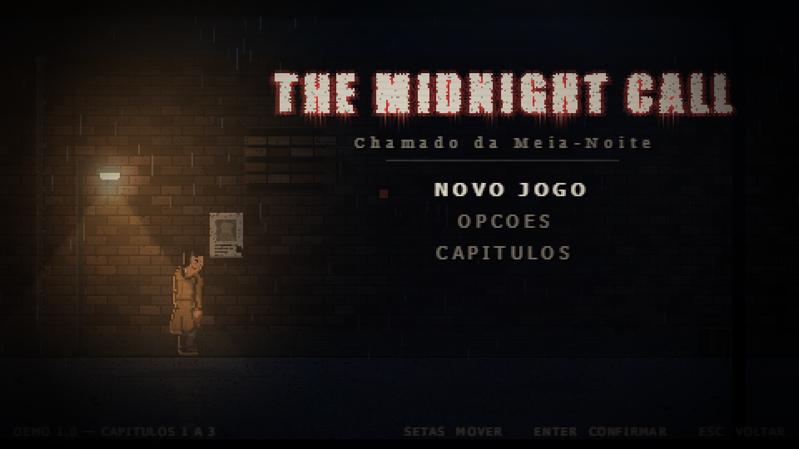
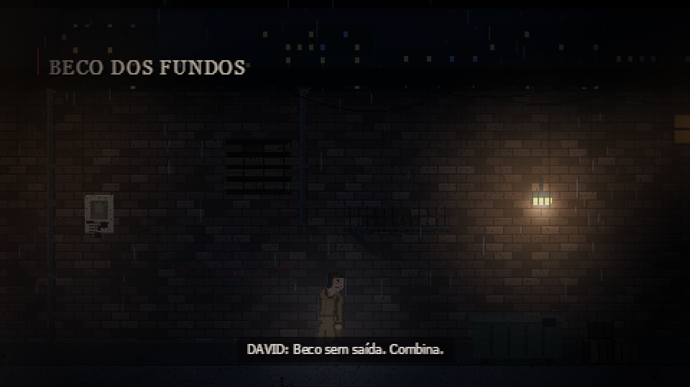
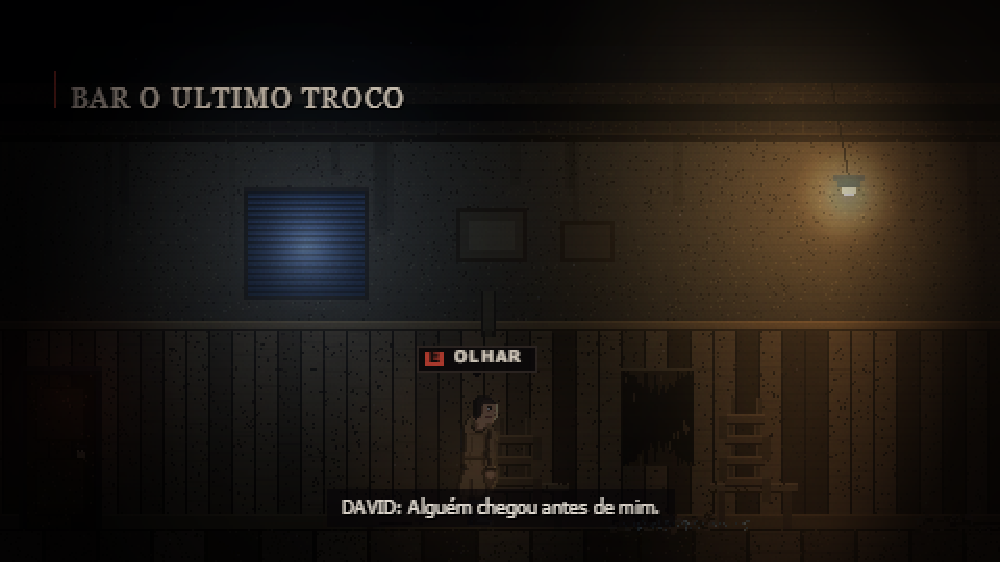
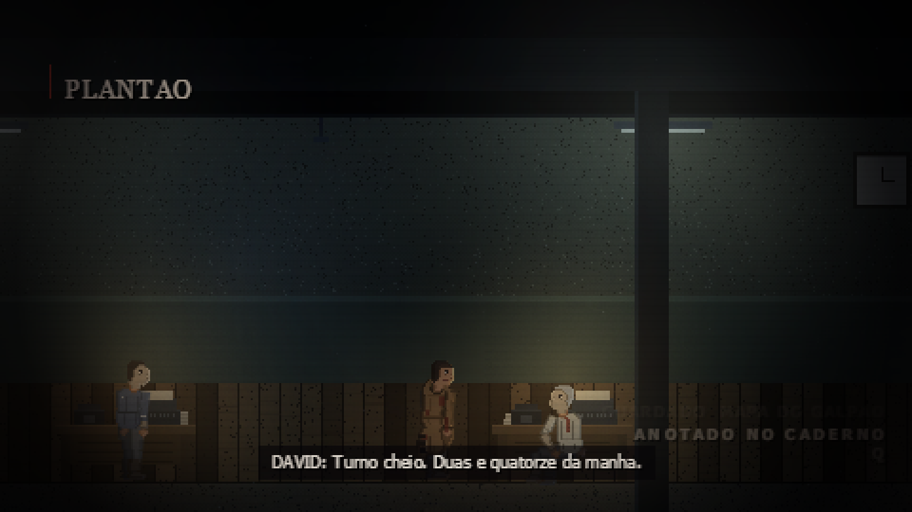

<div align="center">

# THE MIDNIGHT CALL
### Chamado da Meia-Noite

**Demo 1.0 — Capítulos 1 a 3**

Um detetive atende o telefone à meia-noite e a ligação é dele mesmo.
Terror investigativo em pixel art, 480×270, sem um único arquivo de áudio.

### [⬇ BAIXAR A DEMO](../../releases/latest)

</div>



---

## O que é

Sete anos atrás, a casa de David Kane pegou fogo com a mulher e a filha
dentro. Nunca houve corpo para enterrar. Ele continua imprimindo cartaz
de desaparecida, e continua sem conseguir acender um cigarro.

À meia-noite, o telefone toca.

Esta demo tem os **três primeiros capítulos jogáveis do começo ao fim** —
o beco e o bar, o galpão, e a delegacia onde ele trabalhou. É investigação,
conversa e o cuidado de não fazer barulho. Não é um jogo de ação: mirando,
os pés dele ficam presos no chão, de propósito.

| | |
|:---:|:---:|
|  |  |
|  | |

---

## Como jogar

1. Baixe **`The Midnight Call.exe`** na [página de download](../../releases/latest)
2. Dois cliques
3. Aperte qualquer tecla

Só isso. **Não precisa instalar nada** — nem Python, nem Java, nem Unity,
nem runtime nenhum. Está tudo dentro do executável. Não instala nada na sua
máquina, não mexe no registro e não precisa de internet.

> **O Windows vai avisar na primeira vez.** Vai aparecer uma tela azul
> dizendo "O Windows protegeu o seu computador". Clique em **Mais
> informações** → **Executar assim mesmo**. Isso acontece com todo programa
> que não tem assinatura digital paga; não é sinal de problema com o jogo.
> Se o antivírus reclamar, use a **versão em pasta** (o `.zip`), que não se
> descompacta sozinha e costuma passar limpa.

**Requisitos:** Windows 10 ou 11, 64 bits. Mais nada.

### Controles

```
ANDAR .............. A / D  ou setas        CORRER ......... SHIFT (segurar)
INTERAGIR / FALAR .. E                      SOCAR .......... J  ou  ESPAÇO

MIRAR .............. BOTÃO DIREITO (segurar)
SUBIR O CANO ....... MOUSE ↑ / ↓            ATIRAR ......... BOTÃO ESQUERDO
RECARREGAR ......... R

CASACO ............. TAB                    CADERNO ........ Q
MAPA ............... M                      ISQUEIRO ....... F
PRENDER O FÔLEGO ... SHIFT, escondido

PAUSAR ............. ESC                    TELA CHEIA ..... F11
PULAR A ABERTURA ... segure ESC ou ENTER
```

---

## Como isso foi feito

O jogo é **HTML e JavaScript puro** — sem engine, sem framework, sem
biblioteca. Todo o cenário é desenhado retângulo por retângulo em canvas, e
**todo o som é sintetizado em tempo real**: a chuva, o vento, os passos, o
tiro, a porta, o piano do menu. Não existe um único arquivo de áudio dentro
deste pacote.

O executável não é o jogo empacotado num navegador. Ele sobe um servidor
local na sua própria máquina (em `127.0.0.1`, que só ela enxerga) e abre uma
janela nativa apontando para ele. É por isso que abre rápido e não tem barra
de endereço.

**Este repositório contém a oficina, não o jogo.** O código do jogo vive em
[midnight-call-2026](https://github.com/luizhenriquevfernandes2008-ops/midnight-call-2026).
Aqui ficam os scripts que transformam aquilo num `.exe`:

| | |
|---|---|
| `lancador.py` | o que vira o executável: servidor local + janela nativa |
| `construir.py` | monta os dois pacotes, a partir de um **commit** do jogo |
| `verificar.py` | abre a janela e pergunta ao próprio jogo se ele está de pé |
| `fazer_icone.py` | desenha o ícone em Python puro, sem dependência |

Para reconstruir:

```bash
python construir.py
```

Ele acha o projeto sozinho, exporta o último commit, tira o que não pode ser
distribuído, e gera o `.exe` e o `.zip`. Depois, `python verificar.py`
confere que o pacote **roda de verdade** — não que ele compilou.

---

## O que não está aqui

A música da casa e a dublagem da abertura ficaram de fora do pacote. A
primeira porque é faixa de terceiro não licenciada; a segunda porque a
gravação atual não corresponde ao roteiro, e voz dizendo uma coisa com
legenda dizendo outra é pior que voz nenhuma. O jogo lida com as duas
ausências sozinho: entra o piano sintetizado, e a abertura roda pelas
legendas.

O **Capítulo 4** está escrito e ainda não implementado. Ele não está nesta
demo.

---

<div align="center">

Feito por **Luiz Fernandes**.

</div>
